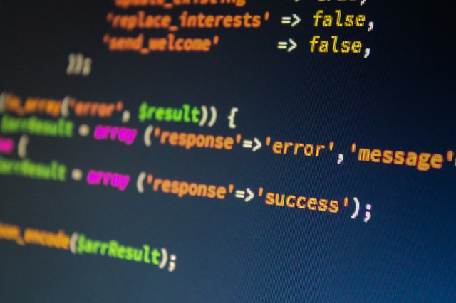

---
titleBreadcrumb: Om Sidan
...
Om sidan
==============================================

Denna sidan är byggd för design kursen på programmet [Webbprogrammering](https://www.bth.se/distansutbildningar/webbprogrammering) som jag just nu läser som distansutbildning på [BTH](https://www.bth.se/).

Sidan är byggd med PHP-ramverket Anax-Flat och är en del i kursen som handlar om webbdesign och användbarhet för webben.

[Min Anax-Flat på Github](https://github.com/ptorn/anax-flat)
[Min Anax-Flat-Theme på Github](https://github.com/ptorn/anax-flat-theme)
