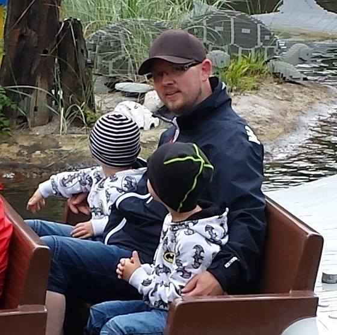

---
titleBreadcrumb: Om Peder
...
Vem är Peder Tornberg
===============================

Peder Tornberg heter jag och jag är en 34 årig småbarnsförälder. Born and raised i Malmö/Limhamn. Senare flyttade jag till Kanada och gifte mig där med min fru Linda. Efter det flyttade vi tillbaka till Sverige närmare bestämt Växjö. Tillslut hamnade jag i lilla Lessebo precis utanför Växjö. Här bosatte jag mig med min fru Linda och våra 2 barn i ett hus där ungarna kan springa runt och leka i lugn och ro.

Jag läser distansprogrammet "Webbprogrammering" på BTH. Har programmerat sedan mitten på 90-talet och har genom åren kommit i kontakt med Visaul Basic, TI-BASIC, HTML, PHP, CSS, JavaScript, jQuery. Samt det senaste tillskottet som jag kom i kontakt med här på BTH nämligen Python.

Ser fram emot att ta mig an denna kursen i javascript och fräsha upp och lära mig nya saker inom området.

När jag inte pluggar på BTH så jobbar jag heltid och kopplar av till en bra film i hemmabiot. Det har blivit en hel del filmer genom åren. Det är något med just envägskommunbikationen där man endast ska ta intryck och inte ge något tillbaka som är avkopplingen.

Men mest av allt så ser jag varje dag fram emot att busa med mina pojkar Kaden och Noah som är 5 och 2 år gamla. Dom är solstrålarna som förgyller livet.

/Peder
